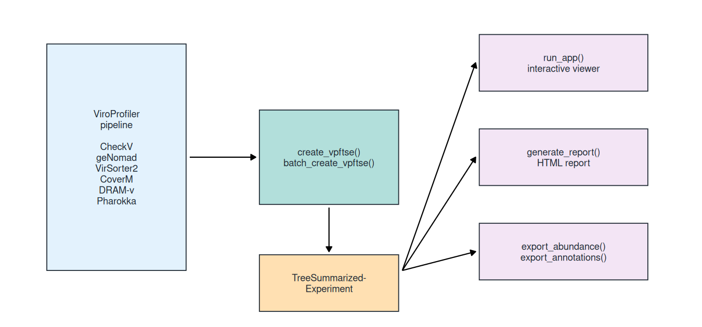

<!-- README.md is generated from README.Rmd. Please edit that file. -->

# vpfkit

<!-- badges: start -->

[](https://github.com/deng-lab/vpfkit/actions/workflows/R-CMD-check.yaml)
<!-- badges: end -->

**vpfkit** (“ViroProfiler toolkit”) turns the output of the
[ViroProfiler](https://github.com/deng-lab/viroprofiler) viral
metagenomics pipeline into something you can analyse in R. It reads the
per-tool result tables, assembles them into a single
`TreeSummarizedExperiment` (TSE), and gives you three ways to work with
that object: an interactive Shiny viewer, a rendered HTML quality
report, and plain-text exports.

<div class="figure">


<p class="caption">
ViroProfiler writes one table per tool; create_vpftse() assembles them
into a single TreeSummarizedExperiment, which the viewer, the report and
the exporters all read.
</p>

</div>

*vpfkit does not run any bioinformatics tool itself. It starts where
ViroProfiler stops: at the result tables.*

## Installation

``` r
install.packages("remotes")
remotes::install_github("deng-lab/vpfkit")
```

vpfkit depends on Bioconductor packages, so install BiocManager first if
you do not have it:

``` r
install.packages("BiocManager")
BiocManager::install(c("SummarizedExperiment", "TreeSummarizedExperiment",
                       "mia", "miaViz", "scater"))
```

Report generation additionally needs the [Quarto
CLI](https://quarto.org/docs/get-started/). Everything else works
without it.

## Building a TSE from a ViroProfiler run

`create_vpftse()` takes one file per tool and returns a single object
holding the abundance matrices, the per-contig annotations and the
sample metadata:

``` r
library(vpfkit)

tse <- create_vpftse(
  fin_abcount    = "abundance/abundance_contigs_count.tsv.gz",
  fin_abtpm      = "abundance/abundance_contigs_tpm.tsv.gz",
  fin_abtmm      = "abundance/abundance_contigs_trimmed_mean.tsv.gz",
  fin_abcov      = "abundance/abundance_contigs_covered_fraction.tsv.gz",
  fin_taxa       = "taxonomy/taxonomy_tse.tsv",
  fin_checkv     = "checkv/quality_summary.tsv",
  fin_virsorter2 = "virsorter2/final-viral-score.tsv",
  fin_vibrant    = "vibrant/VIBRANT_genome_quality.tsv",
  fin_dvf        = "dvf/contigs.fa_gt1bp_dvfpred.txt",
  fin_replicyc   = "bacphlip/contigs.fa.bacphlip"
)
```

`batch_create_vpftse()` does the same for a whole ViroProfiler output
directory. `create_vpftse_vir()` narrows the object down to the contigs
that the detectors agree are viral.

The object carries four abundance assays, all produced by CoverM:

| Assay          | What it measures                                                |
|----------------|-----------------------------------------------------------------|
| `counts`       | Reads mapped per contig per sample                              |
| `tpm`          | Transcripts per million; each column sums to 10<sup>6</sup>     |
| `trimmed_mean` | Trimmed mean of per-base coverage depth, in fold coverage       |
| `covfrac`      | Covered fraction: the share of the contig covered at least once |

`trimmed_mean` is CoverM’s trimmed mean of coverage depth. Objects
written by older versions of vpfkit store it under the name `tmm`; both
names are accepted everywhere in this package. It is **not** edgeR’s
Trimmed Mean of M-values, and it is not a normalized count.

`covfrac` measures breadth of coverage, not abundance. Its use is to
decide whether a contig is present at all: a contig that collects reads
over one short conserved stretch, with no coverage elsewhere, is usually
a false positive. Requiring 75% breadth is the common convention (Roux
et al., 2017, *PeerJ* 5:e3817); the ViroProfiler paper uses 50% (Ru et
al., 2023, *Gut Microbes*). Apply the filter to raw counts **before**
normalizing.

## The interactive viewer

ViroProfiler-viewer is a Shiny app shipped inside the package. It lets
you filter contigs by length, quality, taxonomy, host and replication
cycle, and inspect the result as tables and plots.

``` r
vpfkit::run_app()
```

From a terminal, or on a server:

``` sh
R -e "options(shiny.port = 8080, shiny.host = '0.0.0.0'); vpfkit::run_app()"
```

Then open <http://localhost:8080>. Upload a `viroprofiler_output.rds`
produced by the pipeline, or built with `create_vpftse()`.

A container image is available for a deployment that should not depend
on the local R installation:

``` sh
docker run --rm -p 3838:3838 denglab/vpfkit:latest
```

The image is built from [docker/Dockerfile](docker/Dockerfile) for both
linux/amd64 and linux/arm64.

## Reports and exports

`generate_report()` renders a self-contained HTML summary of a TSE:
dataset composition, CheckV quality, coverage breadth, taxonomy,
diversity, abundance and gene annotations. Sections whose input is
missing explain what is missing instead of failing, so a two-sample
object without gene annotations still produces a complete report.

``` r
generate_report(tse, "reports/quality_report.html")

# Zero out abundances below a coverage-breadth threshold first; the
# threshold used is stated in the report.
generate_report(tse, "reports/filtered.html", covfrac_threshold = 0.75)
```

The export functions write flat files for use outside R:

``` r
export_abundance(tse, "abundance_counts.csv")
export_abundance(tse, "abundance.xlsx", assay.type = "tpm", format = "xlsx")
export_annotations(tse, "contig_annotations.tsv")
export_vpftse(tse, "viroprofiler_output.rds")
```

Each of them creates the output directory if it does not exist, and
returns the path it wrote.

## Documentation

- [vignettes/vpfkit.Rmd](vignettes/vpfkit.Rmd) — a worked example from
  result tables to report.
- [inst/report_template.qmd](inst/report_template.qmd) — the Quarto
  template `generate_report()` renders. Copy it and edit if you want a
  different report.
- [ViroProfiler](https://github.com/deng-lab/viroprofiler) — the
  pipeline that produces the input.

## Citation

Ru J, Khan Mirzaei M, Xue J, Peng X, Deng L. ViroProfiler: a
containerized bioinformatics pipeline for viral metagenomic data
analysis. *Gut Microbes* (2023). <doi:10.1080/19490976.2023.2192522>

## License

GPL (\>= 3). See [LICENSE.md](LICENSE.md).
